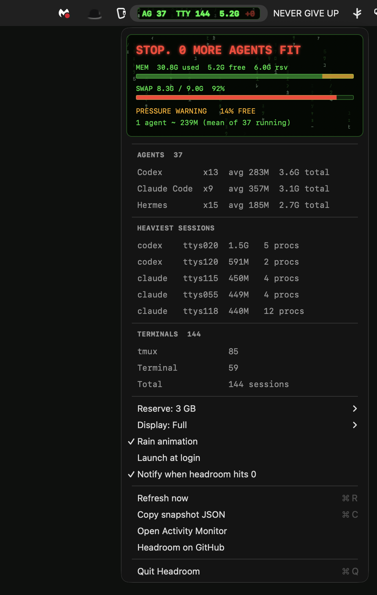

# Headroom

A macOS menu bar meter that tells you how many more AI coding agents (Claude Code, Codex, Gemini CLI and friends) fit before your Mac starts swapping. Free and MIT, and the app never touches the network.

```sh
curl -fsSL https://raw.githubusercontent.com/theluckystrike/headroom/main/install.sh | bash
```

That's the whole install. On Apple silicon it takes about 5 seconds and no Gatekeeper prompt appears. Details and other ways are under [Install](#install).



A real capture from my Mac while writing this. 37 agents across 144 terminals, swap 92% full, and Headroom saying stop.

Headroom is a tiny native app. Swift and AppKit, no dependencies, macOS 13 or later. It counts the AI coding agents you have running, the terminal sessions they live in, and the memory you have left, and turns that into one number. How many more agents fit before the Mac starts swapping hard.

Site: https://theluckystrike.github.io/headroom/

## Why

I often run 30 or more Claude Code, Codex and Hermes agents at a time, spread across 140+ terminal tabs, splits and tmux panes. On a 36 GB Mac that works until it doesn't. Memory runs out, swap fills up, everything stalls, and sometimes the machine crashes and takes every session with it.

Activity Monitor can tell you that memory is tight. It can't tell you whether you can start one more agent. Headroom answers that question at a glance, in the menu bar, every two seconds.

## What it shows

```
AG 12  TTY 31  14.2G  +9
```

| Field | Meaning |
|---|---|
| `AG 12` | Agents running. One agent is one root agent process plus everything it spawned (MCP servers, language servers, shells). |
| `TTY 31` | Terminal sessions. One session is one tty: a tab, a split pane, or a tmux pane. |
| `14.2G` | Available memory, counted the way Activity Monitor counts it: total minus app memory, wired and compressed. |
| `+9` | How many more agents fit before the reserve is hit. Watch this one. |

The text sits in neon green `#00FF41` on a near-black pill with faint katakana rain behind it. The level has three states.

- `ok` means 4 or more agents fit.
- `tight` means 1 to 3 fit, or macOS reports warning memory pressure, or swap is 85% or more used.
- `danger` means 0 fit, or macOS reports critical memory pressure, or swap is 85% or more used and the disk has under 10 GB left for swap to grow.

Click the pill for the dropdown: agents per tool with their memory, sessions per terminal app, available memory, swap, pressure, and the per-agent estimate the number is based on.

## Install

```sh
curl -fsSL https://raw.githubusercontent.com/theluckystrike/headroom/main/install.sh | bash
```

On an Apple silicon Mac the installer downloads the latest [release](https://github.com/theluckystrike/headroom/releases/latest) zip, checks its SHA-256, puts `Headroom.app` in `~/Applications` and the `headroom` command in `~/.local/bin`, then starts the app. Files fetched with curl aren't quarantined, so macOS doesn't show a Gatekeeper warning. It takes a few seconds and needs nothing else installed. Read [install.sh](install.sh) first if you like.

On an Intel Mac, or with `HEADROOM_BUILD=1` set, the same command builds from source instead. That needs the Xcode Command Line Tools (`xcode-select --install`, the full Xcode app isn't needed) and takes a minute or two.

The pill appears on the right side of the menu bar. On a crowded menu bar or a notched MacBook it can be hidden behind the notch. Hold Cmd and drag it left, or quit a few other menu bar apps.

### Download the zip by hand

Get `Headroom-<version>-macos.zip` from [Releases](https://github.com/theluckystrike/headroom/releases/latest), unzip it and move `Headroom.app` to Applications. The app is ad-hoc signed and not notarized by Apple, so a copy downloaded with a browser is quarantined and macOS refuses to open it the first time. Clear the quarantine flag once.

```sh
xattr -dr com.apple.quarantine /Applications/Headroom.app
open /Applications/Headroom.app
```

Or without Terminal. On macOS 15 and later, open the app once, dismiss the warning, then go to System Settings > Privacy & Security, scroll down and click Open Anyway. On macOS 13 and 14 you can right-click the app and choose Open instead.

The release zip is Apple silicon only. The `headroom` command ships inside the bundle.

```sh
mkdir -p ~/.local/bin
ln -sf /Applications/Headroom.app/Contents/Helpers/headroom ~/.local/bin/headroom
```

### Build from a clone

```sh
git clone https://github.com/theluckystrike/headroom && cd headroom && make install
```

Every path installs `Headroom.app` and the `headroom` command line tool.

## The math

Everything comes from counters macOS already keeps.

```
available  = total - (app memory + wired + compressed)      # what Activity Monitor calls free
per_agent  = mean physical footprint of the running agent process trees,
             MCP servers and other children included,
             clamped to [150M, 4G]; 600M when no agents are running
reserve    = 3G by default, doubled while memory pressure is "warning"
headroom   = floor((available - reserve) / per_agent), never below 0; 0 under critical pressure
```

Worked example, measured on my 36 GB Mac on 2026-10-08: app memory 11.6G + wired 3.7G + compressed 13.8G = 29.1G used, so 6.9G available. 37 agents averaged 249M. Pressure was "warning", so the reserve was 6G: floor((6.9 - 6.0) / 0.249) = 3 more agents. A few minutes later available dropped to 5.3G and the answer became 0.

The first version of Headroom used `kern.memorystatus_level`, the figure `memory_pressure` prints. On the same Mac that day it said 45% free (16.2G), while Activity Monitor's count was 5.3G to 6.9G, the compressor held 13.8G of RAM and swap was 91% full. The estimate came out at +69 agents. That number would have crashed the machine, so Headroom now uses the stricter count.

The reserve covers the OS, your browser, and the bursts agents make when they run tests or builds. The default per-agent cost is only used until at least one agent is running to measure. The reserve, the default per-agent cost and the swap threshold are settings.

## Supported agents

| Agent | Agent | Agent |
|---|---|---|
| Claude Code | Codex | Gemini CLI |
| Hermes | Aider | opencode |
| Goose | Cursor Agent | Amp |
| Copilot CLI | Droid | Crush |
| Qwen Code | | |

Headroom recognizes the root process of an interactive or headless session and folds its whole process tree into one agent. Helpers such as app-server daemons, MCP servers and native messaging hosts are counted inside the agent that started them, not as agents of their own. An agent started by another agent counts as its own agent and isn't double counted in its parent's memory.

Missing your agent? Open an issue with the output of `ps -o pid,ppid,comm,args -U $USER | grep <name>` while it runs.

## Terminals

One session is one tty. That means every tab, every split pane and every tmux pane counts as one session, whichever app hosts it. Sessions are grouped by host app in the dropdown:

Terminal, iTerm2, Ghostty, WezTerm, kitty, Alacritty, Warp, VS Code, Cursor, Zed, and tmux.

## CLI

The `headroom` command prints the same numbers in a shell.

```sh
headroom            # human-readable summary
headroom --line     # one line: AG 12 | TTY 31 | 14.2G free | +9
headroom --json     # full snapshot as JSON, for scripts
headroom --watch    # refresh in place every 2 seconds
```

For the tmux status bar, add this to `~/.tmux.conf`.

```tmux
set -g status-interval 5
set -g status-right '#(headroom --line)'
```

For the Claude Code status line, add this to `~/.claude/settings.json`.

```json
{
  "statusLine": {
    "type": "command",
    "command": "headroom --line"
  }
}
```

Every Claude Code session then shows the fleet and how many more agents fit, right under the prompt.

## Privacy

- No network access. Headroom doesn't open a single connection.
- No telemetry, no analytics, no crash reporter.
- It reads only process names, arguments and memory figures of processes owned by your own user, plus system memory counters. It never reads file contents, terminal output or your prompts.

## Performance

- Polls once every 2 seconds. One `sysctl(KERN_PROC_ALL)` call reads the whole process table; argv and executable paths are cached per pid; memory footprints are read only for processes inside agent trees.
- The rain animates at 5 fps (cells snap to whole rows, so more frames add cost, not motion) and pauses in Low Power Mode, while the screen sleeps, and while the menu bar is hidden.
- Measured on an M3 Pro with 1,150 processes and 37 agents: 1.2% of one core with rain off, 1.5 to 1.9% with rain on (about 0.2% of the whole CPU), 14 MB of memory.

## Uninstall

```sh
curl -fsSL https://raw.githubusercontent.com/theluckystrike/headroom/main/uninstall.sh | bash
```

That quits the app and removes the app, the `headroom` command, `~/.headroom` and the app's preferences. To do it by hand, quit Headroom from its menu, then run this.

```sh
rm -rf /Applications/Headroom.app ~/Applications/Headroom.app
rm -f /usr/local/bin/headroom ~/.local/bin/headroom
```

If you added it as a login item, remove it in System Settings > General > Login Items. If you used the Claude Code or tmux snippets above, remove those lines too.

## FAQ

### Why not just use Activity Monitor

Activity Monitor shows processes, not agents. A single Claude Code session can be a dozen processes: node, several MCP servers, a language server, shells. Activity Monitor also doesn't know which of your 144 ttys hold agents, and it doesn't do the division for you. Headroom answers one question, "can I start one more?", without opening a window.

### Why not free memory, or kern.memorystatus_level

Free memory on macOS is close to zero most of the time by design: the kernel keeps file cache around until something needs the space, so it undercounts. `kern.memorystatus_level` overcounts once the compressor is large, as [The math](#the-math) shows. Total minus app memory, wired and compressed is the figure Activity Monitor uses, and it stays honest when the compressor is full.

### An agent is a tree, not a process

Claude Code roots are 120 to 390 MB each on my Mac, but the MCP servers, node and python children they spawn can double or triple that. Headroom measures the whole tree, because the whole tree is what the next agent will cost.

### How exact the estimate is

It isn't exact. It's the mean of what your agents use right now, so it adapts to how you work and heavy sessions pull it up. Agents that start builds or test suites spike above it, which is what the reserve is for. Raise the reserve if you still hit swap.

### Intel Macs

It should work. Nothing in it is Apple silicon specific, and the installer builds from source on Intel. It's developed and tested on M-series Macs.

## Contributing

Issues and pull requests are welcome. The code is split into small parts:

- `Sources/HeadroomCore`: pure Swift logic (classification, aggregation, the math, formatting). Builds and tests on Linux too: `swift test`.
- `Sources/HeadroomMac`: the macOS probes (libproc, mach, sysctl).
- `Sources/Headroom`: the menu bar app.
- `Sources/headroom-cli`: the `headroom` command.
- `docs/`: this README's images and the website. `python3 docs/make_hero.py` and `python3 docs/make_og.py` regenerate the images.

Adding an agent usually means one rule in the classifier and one test with a real `ps` line. Please keep the app dependency free.

## License

MIT. Copyright (c) 2026 Michael Lip ([github.com/theluckystrike](https://github.com/theluckystrike)). See [LICENSE](LICENSE).
