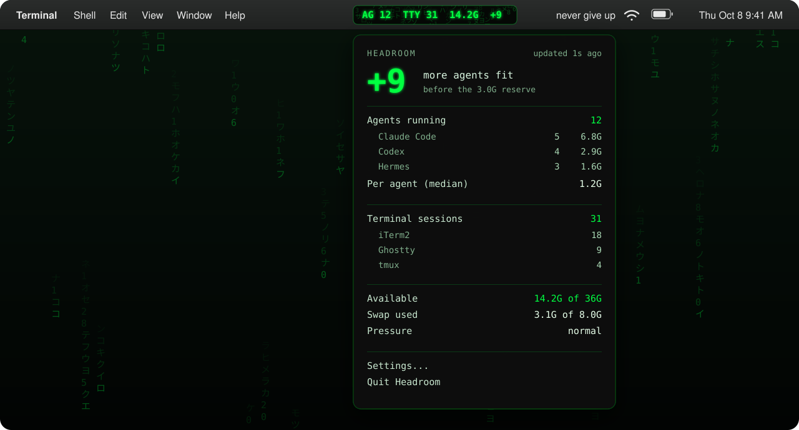

# Headroom

How many more AI agents can your Mac take? A Matrix-style menu bar meter for agent fleets.



Headroom is a tiny native macOS menu bar app. Swift and AppKit, no dependencies, macOS 13 or later. It counts the AI coding agents you have running, the terminal sessions they live in, and the memory you have left, and turns that into one number: how many more agents fit before the Mac starts swapping hard.

Site: https://theluckystrike.github.io/headroom/

## Why

I run a dozen Claude Code, Codex and Hermes agents at a time, spread across more than 100 terminal tabs, splits and tmux panes. On a 36 GB Mac that works until it does not: memory runs out, swap fills up, everything stalls, and sometimes the machine crashes and takes every session with it.

Activity Monitor can tell you that memory is tight. It cannot tell you whether you can start one more agent. Headroom answers that question at a glance, in the menu bar, every two seconds.

## What it shows

```
AG 12  TTY 31  14.2G  +9
```

| Field | Meaning |
|---|---|
| `AG 12` | Agents running. One agent is one root agent process plus everything it spawned (MCP servers, language servers, shells). |
| `TTY 31` | Terminal sessions. One session is one tty: a tab, a split pane, or a tmux pane. |
| `14.2G` | Memory macOS can hand out without swapping hard. |
| `+9` | How many more agents fit before the reserve is hit. This is the number to watch. |

The text sits in neon green `#00FF41` on a near-black pill with faint katakana rain behind it. The level has three states:

- **ok**: 4 or more agents fit.
- **tight**: 1 to 3 fit.
- **danger**: 0 fit, or macOS already reports critical memory pressure, or swap is 85% or more used.

Click the pill for the dropdown: agents per tool with their memory, sessions per terminal app, available memory, swap, pressure, and the per-agent estimate the number is based on.

## Install

Requirements: macOS 13 or later and Xcode Command Line Tools (`xcode-select --install`). The full Xcode app is not needed.

**One-liner**

```sh
curl -fsSL https://raw.githubusercontent.com/theluckystrike/headroom/main/install.sh | bash
```

This builds Headroom from source on your Mac with the Swift compiler that ships with the Command Line Tools. Because the app is built locally, there is no unsigned binary to download and no Gatekeeper prompt. Read [install.sh](install.sh) first if you like; it is short.

**From a clone**

```sh
git clone https://github.com/theluckystrike/headroom && cd headroom && make install
```

Both paths install `Headroom.app` and the `headroom` command line tool.

## The math

Everything comes from three numbers macOS already keeps.

```
available  = total * kern.memorystatus_level / 100
per_agent  = median physical footprint of the running agent process trees,
             MCP servers and other children included,
             clamped to [150M, 4G]; 600M when no agents are running
headroom   = floor((available - reserve) / per_agent), never below 0
reserve    = 3G by default
danger     = headroom == 0  or  memory pressure is critical  or  swap >= 85% used
```

Worked example from my Mac: 36 GB total, `kern.memorystatus_level` 41, so available is 36 x 41 / 100 = 14.8 GB. With 3 GB reserved and the median agent tree at 1.2 GB, floor(11.8 / 1.2) = 9 more agents fit.

The reserve covers the OS, your browser, and the bursts agents make when they run tests or builds. The default per-agent cost is only used until at least one agent is running to measure. The reserve, the default per-agent cost and the swap threshold are settings.

## Supported agents

| Agent | Agent | Agent |
|---|---|---|
| Claude Code | Codex | Gemini CLI |
| Hermes | Aider | opencode |
| Goose | Cursor Agent | Amp |
| Copilot CLI | Droid | Crush |
| Qwen Code | | |

Headroom recognizes the root process of an interactive or headless session and folds its whole process tree into one agent. Helpers such as app-server daemons, MCP servers and native messaging hosts are counted inside the agent that started them, not as agents of their own. An agent started by another agent counts as its own agent and is not double counted in its parent's memory.

Missing your agent? Open an issue with the output of `ps -o pid,ppid,comm,args -U $USER | grep <name>` while it runs.

## Terminals

One session is one tty. That means every tab, every split pane and every tmux pane counts as one session, whichever app hosts it. Sessions are grouped by host app in the dropdown:

Terminal, iTerm2, Ghostty, WezTerm, kitty, Alacritty, Warp, VS Code, Cursor, Zed, and tmux.

## CLI

The `headroom` command prints the same numbers in a shell.

```sh
headroom            # human-readable summary
headroom --line     # one line: AG 12 | TTY 31 | 14.2G free | +9
headroom --json     # full snapshot as JSON, for scripts
headroom --watch    # refresh in place every 2 seconds
```

**tmux status bar.** In `~/.tmux.conf`:

```tmux
set -g status-interval 5
set -g status-right '#(headroom --line)'
```

**Claude Code statusLine.** In `~/.claude/settings.json`:

```json
{
  "statusLine": {
    "type": "command",
    "command": "headroom --line"
  }
}
```

Every Claude Code session then shows the fleet and how many more agents fit, right under the prompt.

## Privacy

- No network access. Headroom does not open a single connection.
- No telemetry, no analytics, no crash reporter.
- It reads only process names, arguments and memory figures of processes owned by your own user, plus system memory counters. It never reads file contents, terminal output or your prompts.

## Performance

- Polls once every 2 seconds. A full scan targets under 25 ms.
- The rain animates at 10 fps and pauses in Low Power Mode and while the screen sleeps.
- Target: under 1% CPU on an M-series Mac.

## Uninstall

Quit Headroom from its menu, then:

```sh
rm -rf /Applications/Headroom.app ~/Applications/Headroom.app
rm -f /usr/local/bin/headroom ~/.local/bin/headroom
```

If you added it as a login item, remove it in System Settings > General > Login Items. If you used the Claude Code or tmux snippets above, remove those lines too.

## FAQ

**Why not just use Activity Monitor?**
Activity Monitor shows processes, not agents. A single Claude Code session can be a dozen processes: node, several MCP servers, a language server, shells. Activity Monitor also does not know which of your 130 ttys hold agents, and it does not do the division for you. Headroom answers one question, "can I start one more?", without opening a window.

**Why `kern.memorystatus_level` instead of "free" memory?**
Free memory on macOS is close to zero most of the time by design: the kernel keeps file cache and compressed pages around until something needs the space. `kern.memorystatus_level` is the percentage of memory the kernel considers available before it has to start applying pressure, which is the same figure `memory_pressure` prints. It is the number that predicts swapping, so it is the number that predicts a stall.

**Why can an agent be more than a process?**
Because an agent is a tree, not a process. Claude Code roots are 120 to 390 MB each on my Mac, but the MCP servers, node and python children they spawn can double or triple that. Headroom measures the whole tree, because the whole tree is what the next agent will cost.

**Is the estimate exact?**
No. It is a median of what your agents use right now, so it adapts to how you work. Agents that start builds or test suites spike above it, which is what the reserve is for. Raise the reserve if you still hit swap.

**Does it work on Intel Macs?**
It should; nothing in it is Apple silicon specific. It is developed and tested on M-series Macs.

## Contributing

Issues and pull requests are welcome. The code is split into small parts:

- `Sources/HeadroomCore`: pure Swift logic (classification, aggregation, the math, formatting). Builds and tests on Linux too: `swift test`.
- `Sources/HeadroomMac`: the macOS probes (libproc, mach, sysctl).
- `Sources/Headroom`: the menu bar app.
- `Sources/headroom-cli`: the `headroom` command.
- `docs/`: this README's images and the website. `python3 docs/make_hero.py` and `python3 docs/make_og.py` regenerate the images.

Adding an agent usually means one rule in the classifier and one test with a real `ps` line. Please keep the app dependency free.

## License

MIT. Copyright (c) 2026 Michael Lip ([github.com/theluckystrike](https://github.com/theluckystrike)). See [LICENSE](LICENSE).
